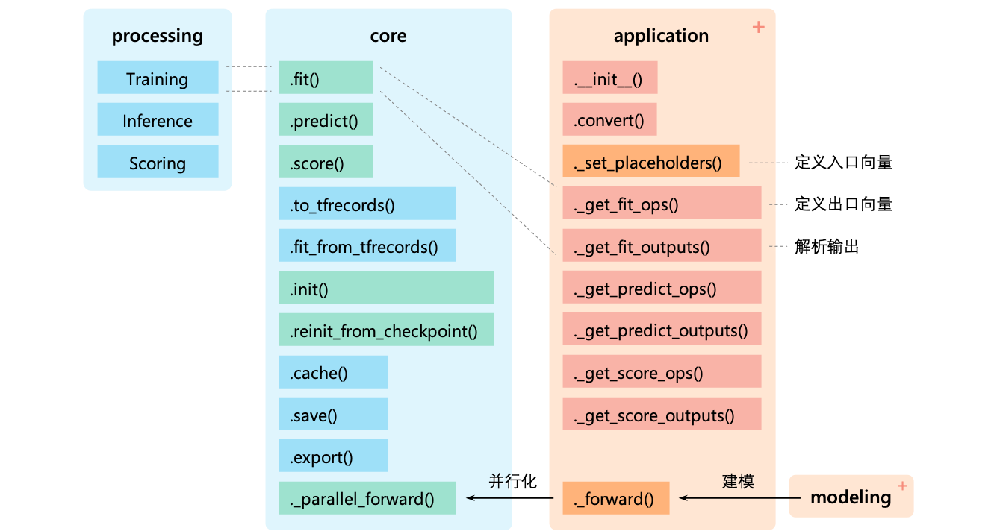

<p align="center">
    <br>
    	
    <br>
<p>
<p align="center">
    <a>
        
    </a>
    <a>
        
    </a>
    <a>
        
    </a>
    <a>
        
    </a>
</p>


兼容 Tensorflow1.x/2.x 的高层封装 (Transformer/GPT-2/BERT/ALBERT/UniLM/XLNet/ELECTRA 等)，使用简单的代码完成语言模型/文本分类/文本生成/命名实体识别/机器阅读理解/机器翻译/序列标注/知识蒸馏任务。适用于 NLP 从业者。

### 特性

- 高效调用：三行代码完成训练及推理
- 高效运行：一行代码设置多进程/多 GPU 并行
- 品类丰富：支持约 40 种模型类
- 高分保证：提供分层学习率、对抗式训练等多项训练技巧
- 可供部署：导出模型 PB 文件，供线上部署

### 安装

``` bash
git clone https://github.com/geyingli/unif
cd unif
python3 setup.py install --user
```

若需卸载，通过 `pip3 uninstall uf` 即可。

### 快速上手

``` python
import uf

# 新建模型（使用demo配置文件进行示范）
model = uf.BERTClassifier(config_file="./demo/bert_config.json", vocab_file="./demo/vocab.txt")

# 定义训练样本
X, y = ["久旱逢甘露", "他乡遇故知"], [1, 0]

# 训练
model.fit(X, y)

# 推理
print(model.predict(X))
```

## 模型列表

| 语言模型 				| 说明                                            | 中文预训练参数                                    |
| :----------- | :----------- | :------------ |
| [`BERTLM`](./examples/tutorial/BERTLM.ipynb) | 结合 MLM 和 NSP 任务，随机采样自下文及其他文档 | [`bert-base`](https://storage.googleapis.com/bert_models/2018_11_03/chinese_L-12_H-768_A-12.zip),[`roberta-wwm-ext-base`](https://drive.google.com/uc?export=download&id=1jMAKIJmPn7kADgD3yQZhpsqM-IRM1qZt),[`roberta-wwm-ext-large`](https://drive.google.com/uc?export=download&id=1dtad0FFzG11CBsawu8hvwwzU2R0FDI94),[`macbert-base`](https://drive.google.com/uc?export=download&id=1aV69OhYzIwj_hn-kO1RiBa-m8QAusQ5b),[`macbert-large`](https://drive.google.com/uc?export=download&id=1lWYxnk1EqTA2Q20_IShxBrCPc5VSDCkT) |
| [`RoBERTaLM`](./examples/tutorial/RoBERTaLM.ipynb) 		| 仅 MLM 任务，采样至文档结束 | [`bert-base`](https://storage.googleapis.com/bert_models/2018_11_03/chinese_L-12_H-768_A-12.zip),[`roberta-wwm-ext-base`](https://drive.google.com/uc?export=download&id=1jMAKIJmPn7kADgD3yQZhpsqM-IRM1qZt),[`roberta-wwm-ext-large`](https://drive.google.com/uc?export=download&id=1dtad0FFzG11CBsawu8hvwwzU2R0FDI94),[`macbert-base`](https://drive.google.com/uc?export=download&id=1aV69OhYzIwj_hn-kO1RiBa-m8QAusQ5b),[`macbert-large`](https://drive.google.com/uc?export=download&id=1lWYxnk1EqTA2Q20_IShxBrCPc5VSDCkT) |
| [`ALBERTLM`](./examples/tutorial/ALBERTLM.ipynb) 		| 结合 MLM 和 SOP，随机采样自上下文及其他文档 | [`albert-tiny`](https://storage.googleapis.com/albert_zh/albert_tiny_zh_google.zip),[`albert-small`](https://storage.googleapis.com/albert_zh/albert_small_zh_google.zip),[`albert-base`](https://storage.googleapis.com/albert_zh/albert_base_zh_additional_36k_steps.zip),[`albert-large`](https://storage.googleapis.com/albert_zh/albert_large_zh.zip),[`albert-xlarge`](https://storage.googleapis.com/albert_zh/albert_xlarge_zh_183k.zip) |
| [`ELECTRALM`](./examples/tutorial/ELECTRALM.ipynb) 		| 结合 MLM 和 RTD，生成器与判别器联合训练 | [`electra-small`](https://drive.google.com/file/d/1uab-9T1kR9HgD2NB0Kz1JB_TdSKgJIds/view?usp=drive_open),[`electra-small-ex`](https://drive.google.com/file/d/1LluPORc7xtFmCTFR4IF17q77ip82i7__/view),[`electra-base`](https://drive.google.com/file/d/1FMwrs2weFST-iAuZH3umMa6YZVeIP8wD/view),[`electra-large`](https://drive.google.com/file/d/1ny0NMLkEWG6rseDLiF_NujdHxDcIN51m/view) |
| [`VAELM`](./examples/tutorial/VAELM.ipynb) | 可生成语言文本负样本，也可提取向量用于聚类 |  |
| [`GPT2LM`](./examples/tutorial/GPT2LM.ipynb) | 自回归式文本生成 |  |
| [`UniLM`](./examples/tutorial/UniLM.ipynb) | 结合双向、单向及 Seq2Seq 建模的全能语言模型 | [`bert-base`](https://storage.googleapis.com/bert_models/2018_11_03/chinese_L-12_H-768_A-12.zip),[`roberta-wwm-ext-base`](https://drive.google.com/uc?export=download&id=1jMAKIJmPn7kADgD3yQZhpsqM-IRM1qZt),[`roberta-wwm-ext-large`](https://drive.google.com/uc?export=download&id=1dtad0FFzG11CBsawu8hvwwzU2R0FDI94),[`macbert-base`](https://drive.google.com/uc?export=download&id=1aV69OhYzIwj_hn-kO1RiBa-m8QAusQ5b),[`macbert-large`](https://drive.google.com/uc?export=download&id=1lWYxnk1EqTA2Q20_IShxBrCPc5VSDCkT) |

| 命名实体识别 				| 说明                                            | 中文预训练参数                                    |
| :----------- | :----------- | :------------ |
| [`BERTNER`](./examples/tutorial/BERTNER.ipynb) 		| - | [`bert-base`](https://storage.googleapis.com/bert_models/2018_11_03/chinese_L-12_H-768_A-12.zip),[`roberta-wwm-ext-base`](https://drive.google.com/uc?export=download&id=1jMAKIJmPn7kADgD3yQZhpsqM-IRM1qZt),[`roberta-wwm-ext-large`](https://drive.google.com/uc?export=download&id=1dtad0FFzG11CBsawu8hvwwzU2R0FDI94),[`macbert-base`](https://drive.google.com/uc?export=download&id=1aV69OhYzIwj_hn-kO1RiBa-m8QAusQ5b),[`macbert-large`](https://drive.google.com/uc?export=download&id=1lWYxnk1EqTA2Q20_IShxBrCPc5VSDCkT) |
| [`BERTCRFNER`](./examples/tutorial/BERTCRFNER.ipynb) 		| 结合 CRF | [`bert-base`](https://storage.googleapis.com/bert_models/2018_11_03/chinese_L-12_H-768_A-12.zip),[`roberta-wwm-ext-base`](https://drive.google.com/uc?export=download&id=1jMAKIJmPn7kADgD3yQZhpsqM-IRM1qZt),[`roberta-wwm-ext-large`](https://drive.google.com/uc?export=download&id=1dtad0FFzG11CBsawu8hvwwzU2R0FDI94),[`macbert-base`](https://drive.google.com/uc?export=download&id=1aV69OhYzIwj_hn-kO1RiBa-m8QAusQ5b),[`macbert-large`](https://drive.google.com/uc?export=download&id=1lWYxnk1EqTA2Q20_IShxBrCPc5VSDCkT) |
| [`BERTCRFCascadeNER`](./examples/tutorial/BERTCRFCascadeNER.ipynb) | 实体识别与分类同时进行的级联架构 | [`bert-base`](https://storage.googleapis.com/bert_models/2018_11_03/chinese_L-12_H-768_A-12.zip),[`roberta-wwm-ext-base`](https://drive.google.com/uc?export=download&id=1jMAKIJmPn7kADgD3yQZhpsqM-IRM1qZt),[`roberta-wwm-ext-large`](https://drive.google.com/uc?export=download&id=1dtad0FFzG11CBsawu8hvwwzU2R0FDI94),[`macbert-base`](https://drive.google.com/uc?export=download&id=1aV69OhYzIwj_hn-kO1RiBa-m8QAusQ5b),[`macbert-large`](https://drive.google.com/uc?export=download&id=1lWYxnk1EqTA2Q20_IShxBrCPc5VSDCkT) |

| 机器翻译 				| 说明                                            | 中文预训练参数                                    |
| :----------- | :----------- | :------------ |
| [`TransformerMT`](./examples/tutorial/TransformerMT.ipynb) | 共享词表，标准 Seq2Seq 架构 |  |

| 机器阅读理解 				| 说明                                            | 中文预训练参数                                    |
| :----------- | :----------- | :------------ |
| [`BERTMRC`](./examples/tutorial/BERTMRC.ipynb) 		| - | [`bert-base`](https://storage.googleapis.com/bert_models/2018_11_03/chinese_L-12_H-768_A-12.zip),[`roberta-wwm-ext-base`](https://drive.google.com/uc?export=download&id=1jMAKIJmPn7kADgD3yQZhpsqM-IRM1qZt),[`roberta-wwm-ext-large`](https://drive.google.com/uc?export=download&id=1dtad0FFzG11CBsawu8hvwwzU2R0FDI94),[`macbert-base`](https://drive.google.com/uc?export=download&id=1aV69OhYzIwj_hn-kO1RiBa-m8QAusQ5b),[`macbert-large`](https://drive.google.com/uc?export=download&id=1lWYxnk1EqTA2Q20_IShxBrCPc5VSDCkT) |
| [`RoBERTaMRC`](./examples/tutorial/RoBERTaMRC.ipynb) 		| - | [`bert-base`](https://storage.googleapis.com/bert_models/2018_11_03/chinese_L-12_H-768_A-12.zip),[`roberta-wwm-ext-base`](https://drive.google.com/uc?export=download&id=1jMAKIJmPn7kADgD3yQZhpsqM-IRM1qZt),[`roberta-wwm-ext-large`](https://drive.google.com/uc?export=download&id=1dtad0FFzG11CBsawu8hvwwzU2R0FDI94),[`macbert-base`](https://drive.google.com/uc?export=download&id=1aV69OhYzIwj_hn-kO1RiBa-m8QAusQ5b),[`macbert-large`](https://drive.google.com/uc?export=download&id=1lWYxnk1EqTA2Q20_IShxBrCPc5VSDCkT) |
| [`ALBERTMRC`](./examples/tutorial/ALBERTMRC.ipynb) 		| - | [`albert-tiny`](https://storage.googleapis.com/albert_zh/albert_tiny_zh_google.zip),[`albert-small`](https://storage.googleapis.com/albert_zh/albert_small_zh_google.zip),[`albert-base`](https://storage.googleapis.com/albert_zh/albert_base_zh_additional_36k_steps.zip),[`albert-large`](https://storage.googleapis.com/albert_zh/albert_large_zh.zip),[`albert-xlarge`](https://storage.googleapis.com/albert_zh/albert_xlarge_zh_183k.zip) |
| [`ELECTRAMRC`](./examples/tutorial/ELECTRAMRC.ipynb) 		| - | [`electra-small`](https://drive.google.com/file/d/1uab-9T1kR9HgD2NB0Kz1JB_TdSKgJIds/view?usp=drive_open),[`electra-small-ex`](https://drive.google.com/file/d/1LluPORc7xtFmCTFR4IF17q77ip82i7__/view),[`electra-base`](https://drive.google.com/file/d/1FMwrs2weFST-iAuZH3umMa6YZVeIP8wD/view),[`electra-large`](https://drive.google.com/file/d/1ny0NMLkEWG6rseDLiF_NujdHxDcIN51m/view) |
| [`SANetMRC`](./examples/tutorial/SANetMRC.ipynb) 		| 引入 Sentence Attention | [`bert-base`](https://storage.googleapis.com/bert_models/2018_11_03/chinese_L-12_H-768_A-12.zip),[`roberta-wwm-ext-base`](https://drive.google.com/uc?export=download&id=1jMAKIJmPn7kADgD3yQZhpsqM-IRM1qZt),[`roberta-wwm-ext-large`](https://drive.google.com/uc?export=download&id=1dtad0FFzG11CBsawu8hvwwzU2R0FDI94),[`macbert-base`](https://drive.google.com/uc?export=download&id=1aV69OhYzIwj_hn-kO1RiBa-m8QAusQ5b),[`macbert-large`](https://drive.google.com/uc?export=download&id=1lWYxnk1EqTA2Q20_IShxBrCPc5VSDCkT) |
| [`BERTVerifierMRC`](./examples/tutorial/BERTVerifierMRC.ipynb) | 抽取 answer span 的同时判断可答性 | [`bert-base`](https://storage.googleapis.com/bert_models/2018_11_03/chinese_L-12_H-768_A-12.zip),[`roberta-wwm-ext-base`](https://drive.google.com/uc?export=download&id=1jMAKIJmPn7kADgD3yQZhpsqM-IRM1qZt),[`roberta-wwm-ext-large`](https://drive.google.com/uc?export=download&id=1dtad0FFzG11CBsawu8hvwwzU2R0FDI94),[`macbert-base`](https://drive.google.com/uc?export=download&id=1aV69OhYzIwj_hn-kO1RiBa-m8QAusQ5b),[`macbert-large`](https://drive.google.com/uc?export=download&id=1lWYxnk1EqTA2Q20_IShxBrCPc5VSDCkT) |
| [`RetroReaderMRC`](./examples/tutorial/RetroReaderMRC.ipynb) | 抽取 answer span 的同时判断可答性 | [`bert-base`](https://storage.googleapis.com/bert_models/2018_11_03/chinese_L-12_H-768_A-12.zip),[`roberta-wwm-ext-base`](https://drive.google.com/uc?export=download&id=1jMAKIJmPn7kADgD3yQZhpsqM-IRM1qZt),[`roberta-wwm-ext-large`](https://drive.google.com/uc?export=download&id=1dtad0FFzG11CBsawu8hvwwzU2R0FDI94),[`macbert-base`](https://drive.google.com/uc?export=download&id=1aV69OhYzIwj_hn-kO1RiBa-m8QAusQ5b),[`macbert-large`](https://drive.google.com/uc?export=download&id=1lWYxnk1EqTA2Q20_IShxBrCPc5VSDCkT) |

| 文本分类 (单label) 				| 说明                                            | 中文预训练参数                                    |
| :----------- | :----------- | :------------ |
| [`TextCNNClassifier`](./examples/tutorial/TextCNNClassifier.ipynb) 		| 小而快 |  |
| [`BERTClassifier`](./examples/tutorial/BERTClassifier.ipynb) 		| - | [`bert-base`](https://storage.googleapis.com/bert_models/2018_11_03/chinese_L-12_H-768_A-12.zip),[`roberta-wwm-ext-base`](https://drive.google.com/uc?export=download&id=1jMAKIJmPn7kADgD3yQZhpsqM-IRM1qZt),[`roberta-wwm-ext-large`](https://drive.google.com/uc?export=download&id=1dtad0FFzG11CBsawu8hvwwzU2R0FDI94),[`macbert-base`](https://drive.google.com/uc?export=download&id=1aV69OhYzIwj_hn-kO1RiBa-m8QAusQ5b),[`macbert-large`](https://drive.google.com/uc?export=download&id=1lWYxnk1EqTA2Q20_IShxBrCPc5VSDCkT) |
| [`XLNetClassifier`](./examples/tutorial/XLNetClassifier.ipynb) 		| - | [`xlnet-base`](https://drive.google.com/uc?export=download&id=1m9t-a4gKimbkP5rqGXXsEAEPhJSZ8tvx),[`xlnet-mid`](https://drive.google.com/uc?export=download&id=1342uBc7ZmQwV6Hm6eUIN_OnBSz1LcvfA) |
| [`RoBERTaClassifier`](./examples/tutorial/RoBERTaClassifier.ipynb) 		| - | [`bert-base`](https://storage.googleapis.com/bert_models/2018_11_03/chinese_L-12_H-768_A-12.zip),[`roberta-wwm-ext-base`](https://drive.google.com/uc?export=download&id=1jMAKIJmPn7kADgD3yQZhpsqM-IRM1qZt),[`roberta-wwm-ext-large`](https://drive.google.com/uc?export=download&id=1dtad0FFzG11CBsawu8hvwwzU2R0FDI94),[`macbert-base`](https://drive.google.com/uc?export=download&id=1aV69OhYzIwj_hn-kO1RiBa-m8QAusQ5b),[`macbert-large`](https://drive.google.com/uc?export=download&id=1lWYxnk1EqTA2Q20_IShxBrCPc5VSDCkT) |
| [`ALBERTClassifier`](./examples/tutorial/ALBERTClassifier.ipynb) 		| - | [`albert-tiny`](https://storage.googleapis.com/albert_zh/albert_tiny_zh_google.zip),[`albert-small`](https://storage.googleapis.com/albert_zh/albert_small_zh_google.zip),[`albert-base`](https://storage.googleapis.com/albert_zh/albert_base_zh_additional_36k_steps.zip),[`albert-large`](https://storage.googleapis.com/albert_zh/albert_large_zh.zip),[`albert-xlarge`](https://storage.googleapis.com/albert_zh/albert_xlarge_zh_183k.zip) |
| [`ELECTRAClassifier`](./examples/tutorial/ELECTRAClassifier.ipynb) 		| - | [`electra-small`](https://drive.google.com/file/d/1uab-9T1kR9HgD2NB0Kz1JB_TdSKgJIds/view?usp=drive_open),[`electra-small-ex`](https://drive.google.com/file/d/1LluPORc7xtFmCTFR4IF17q77ip82i7__/view),[`electra-base`](https://drive.google.com/file/d/1FMwrs2weFST-iAuZH3umMa6YZVeIP8wD/view),[`electra-large`](https://drive.google.com/file/d/1ny0NMLkEWG6rseDLiF_NujdHxDcIN51m/view) |
| [`WideAndDeepClassifier`](./examples/tutorial/WideAndDeepClassifier.ipynb) | 通过 Wide & Deep 架构融合句子级别特征 | [`bert-base`](https://storage.googleapis.com/bert_models/2018_11_03/chinese_L-12_H-768_A-12.zip),[`roberta-wwm-ext-base`](https://drive.google.com/uc?export=download&id=1jMAKIJmPn7kADgD3yQZhpsqM-IRM1qZt),[`roberta-wwm-ext-large`](https://drive.google.com/uc?export=download&id=1dtad0FFzG11CBsawu8hvwwzU2R0FDI94),[`macbert-base`](https://drive.google.com/uc?export=download&id=1aV69OhYzIwj_hn-kO1RiBa-m8QAusQ5b),[`macbert-large`](https://drive.google.com/uc?export=download&id=1lWYxnk1EqTA2Q20_IShxBrCPc5VSDCkT) |
| [`SemBERTClassifier`](./examples/tutorial/SemBERTClassifier.ipynb) 		| 通过 SemBERT 架构融合字级别的特征 | [`bert-base`](https://storage.googleapis.com/bert_models/2018_11_03/chinese_L-12_H-768_A-12.zip),[`roberta-wwm-ext-base`](https://drive.google.com/uc?export=download&id=1jMAKIJmPn7kADgD3yQZhpsqM-IRM1qZt),[`roberta-wwm-ext-large`](https://drive.google.com/uc?export=download&id=1dtad0FFzG11CBsawu8hvwwzU2R0FDI94),[`macbert-base`](https://drive.google.com/uc?export=download&id=1aV69OhYzIwj_hn-kO1RiBa-m8QAusQ5b),[`macbert-large`](https://drive.google.com/uc?export=download&id=1lWYxnk1EqTA2Q20_IShxBrCPc5VSDCkT) |
| [`UDAClassifier`](./examples/tutorial/UDAClassifier.ipynb) 		| 结合一致性学习的半监督学习算法 | [`bert-base`](https://storage.googleapis.com/bert_models/2018_11_03/chinese_L-12_H-768_A-12.zip),[`roberta-wwm-ext-base`](https://drive.google.com/uc?export=download&id=1jMAKIJmPn7kADgD3yQZhpsqM-IRM1qZt),[`roberta-wwm-ext-large`](https://drive.google.com/uc?export=download&id=1dtad0FFzG11CBsawu8hvwwzU2R0FDI94),[`macbert-base`](https://drive.google.com/uc?export=download&id=1aV69OhYzIwj_hn-kO1RiBa-m8QAusQ5b),[`macbert-large`](https://drive.google.com/uc?export=download&id=1lWYxnk1EqTA2Q20_IShxBrCPc5VSDCkT) |


| 文本分类 (多label) 				| 说明                                            | 中文预训练参数                                    |
| :----------- | :----------- | :------------ |
| [`BERTBinaryClassifier`](./examples/tutorial/BERTBinaryClassifier.ipynb) 		| - | [`bert-base`](https://storage.googleapis.com/bert_models/2018_11_03/chinese_L-12_H-768_A-12.zip),[`roberta-wwm-ext-base`](https://drive.google.com/uc?export=download&id=1jMAKIJmPn7kADgD3yQZhpsqM-IRM1qZt),[`roberta-wwm-ext-large`](https://drive.google.com/uc?export=download&id=1dtad0FFzG11CBsawu8hvwwzU2R0FDI94),[`macbert-base`](https://drive.google.com/uc?export=download&id=1aV69OhYzIwj_hn-kO1RiBa-m8QAusQ5b),[`macbert-large`](https://drive.google.com/uc?export=download&id=1lWYxnk1EqTA2Q20_IShxBrCPc5VSDCkT) |
| [`XLNetBinaryClassifier`](./examples/tutorial/XLNetBinaryClassifier.ipynb) 		| - | [`xlnet-base`](https://drive.google.com/uc?export=download&id=1m9t-a4gKimbkP5rqGXXsEAEPhJSZ8tvx),[`xlnet-mid`](https://drive.google.com/uc?export=download&id=1342uBc7ZmQwV6Hm6eUIN_OnBSz1LcvfA) |
| [`RoBERTaBinaryClassifier`](./examples/tutorial/RoBERTaBinaryClassifier.ipynb) 		| - | [`bert-base`](https://storage.googleapis.com/bert_models/2018_11_03/chinese_L-12_H-768_A-12.zip),[`roberta-wwm-ext-base`](https://drive.google.com/uc?export=download&id=1jMAKIJmPn7kADgD3yQZhpsqM-IRM1qZt),[`roberta-wwm-ext-large`](https://drive.google.com/uc?export=download&id=1dtad0FFzG11CBsawu8hvwwzU2R0FDI94),[`macbert-base`](https://drive.google.com/uc?export=download&id=1aV69OhYzIwj_hn-kO1RiBa-m8QAusQ5b),[`macbert-large`](https://drive.google.com/uc?export=download&id=1lWYxnk1EqTA2Q20_IShxBrCPc5VSDCkT) |
| [`ALBERTBinaryClassifier`](./examples/tutorial/ALBERTBinaryClassifier.ipynb) 		| - | [`albert-tiny`](https://storage.googleapis.com/albert_zh/albert_tiny_zh_google.zip),[`albert-small`](https://storage.googleapis.com/albert_zh/albert_small_zh_google.zip),[`albert-base`](https://storage.googleapis.com/albert_zh/albert_base_zh_additional_36k_steps.zip),[`albert-large`](https://storage.googleapis.com/albert_zh/albert_large_zh.zip),[`albert-xlarge`](https://storage.googleapis.com/albert_zh/albert_xlarge_zh_183k.zip) |
| [`ELECTRABinaryClassifier`](./examples/tutorial/ELECTRABinaryClassifier.ipynb) 		| - | [`electra-small`](https://drive.google.com/file/d/1uab-9T1kR9HgD2NB0Kz1JB_TdSKgJIds/view?usp=drive_open),[`electra-small-ex`](https://drive.google.com/file/d/1LluPORc7xtFmCTFR4IF17q77ip82i7__/view),[`electra-base`](https://drive.google.com/file/d/1FMwrs2weFST-iAuZH3umMa6YZVeIP8wD/view),[`electra-large`](https://drive.google.com/file/d/1ny0NMLkEWG6rseDLiF_NujdHxDcIN51m/view) |


| 序列标注 				| 说明                                            | 中文预训练参数                                    |
| :----------- | :----------- | :------------ |
| [`BERTSeqClassifier`](./examples/tutorial/BERTSeqClassifier.ipynb) 		| - | [`bert-base`](https://storage.googleapis.com/bert_models/2018_11_03/chinese_L-12_H-768_A-12.zip),[`roberta-wwm-ext-base`](https://drive.google.com/uc?export=download&id=1jMAKIJmPn7kADgD3yQZhpsqM-IRM1qZt),[`roberta-wwm-ext-large`](https://drive.google.com/uc?export=download&id=1dtad0FFzG11CBsawu8hvwwzU2R0FDI94),[`macbert-base`](https://drive.google.com/uc?export=download&id=1aV69OhYzIwj_hn-kO1RiBa-m8QAusQ5b),[`macbert-large`](https://drive.google.com/uc?export=download&id=1lWYxnk1EqTA2Q20_IShxBrCPc5VSDCkT) |
| [`RoBERTaSeqClassifier`](./examples/tutorial/RoBERTaSeqClassifier.ipynb) 		| - | [`bert-base`](https://storage.googleapis.com/bert_models/2018_11_03/chinese_L-12_H-768_A-12.zip),[`roberta-wwm-ext-base`](https://drive.google.com/uc?export=download&id=1jMAKIJmPn7kADgD3yQZhpsqM-IRM1qZt),[`roberta-wwm-ext-large`](https://drive.google.com/uc?export=download&id=1dtad0FFzG11CBsawu8hvwwzU2R0FDI94),[`macbert-base`](https://drive.google.com/uc?export=download&id=1aV69OhYzIwj_hn-kO1RiBa-m8QAusQ5b),[`macbert-large`](https://drive.google.com/uc?export=download&id=1lWYxnk1EqTA2Q20_IShxBrCPc5VSDCkT) |
| [`ALBERTSeqClassifier`](./examples/tutorial/ALBERTSeqClassifier.ipynb) 		| - | [`albert-tiny`](https://storage.googleapis.com/albert_zh/albert_tiny_zh_google.zip),[`albert-small`](https://storage.googleapis.com/albert_zh/albert_small_zh_google.zip),[`albert-base`](https://storage.googleapis.com/albert_zh/albert_base_zh_additional_36k_steps.zip),[`albert-large`](https://storage.googleapis.com/albert_zh/albert_large_zh.zip),[`albert-xlarge`](https://storage.googleapis.com/albert_zh/albert_xlarge_zh_183k.zip) |
| [`ELECTRASeqClassifier`](./examples/tutorial/ELECTRASeqClassifier.ipynb) 		| - | [`electra-small`](https://drive.google.com/file/d/1uab-9T1kR9HgD2NB0Kz1JB_TdSKgJIds/view?usp=drive_open),[`electra-small-ex`](https://drive.google.com/file/d/1LluPORc7xtFmCTFR4IF17q77ip82i7__/view),[`electra-base`](https://drive.google.com/file/d/1FMwrs2weFST-iAuZH3umMa6YZVeIP8wD/view),[`electra-large`](https://drive.google.com/file/d/1ny0NMLkEWG6rseDLiF_NujdHxDcIN51m/view) |
| [`BERTSeqMultiTaskClassifier`](./examples/tutorial/BERTSeqMultiTaskClassifier.ipynb) 		| 序列标注与文本分类相结合的多任务学习 | [`bert-base`](https://storage.googleapis.com/bert_models/2018_11_03/chinese_L-12_H-768_A-12.zip),[`roberta-wwm-ext-base`](https://drive.google.com/uc?export=download&id=1jMAKIJmPn7kADgD3yQZhpsqM-IRM1qZt),[`roberta-wwm-ext-large`](https://drive.google.com/uc?export=download&id=1dtad0FFzG11CBsawu8hvwwzU2R0FDI94),[`macbert-base`](https://drive.google.com/uc?export=download&id=1aV69OhYzIwj_hn-kO1RiBa-m8QAusQ5b),[`macbert-large`](https://drive.google.com/uc?export=download&id=1lWYxnk1EqTA2Q20_IShxBrCPc5VSDCkT) |

| 回归 				| 说明                                            | 中文预训练参数                                    |
| :----------- | :----------- | :------------ |
| [`WideAndDeepRegressor`](./examples/tutorial/WideAndDeepRegressor.ipynb) | 通过 Wide & Deep 架构融合句子级别特征 | [`bert-base`](https://storage.googleapis.com/bert_models/2018_11_03/chinese_L-12_H-768_A-12.zip),[`roberta-wwm-ext-base`](https://drive.google.com/uc?export=download&id=1jMAKIJmPn7kADgD3yQZhpsqM-IRM1qZt),[`roberta-wwm-ext-large`](https://drive.google.com/uc?export=download&id=1dtad0FFzG11CBsawu8hvwwzU2R0FDI94),[`macbert-base`](https://drive.google.com/uc?export=download&id=1aV69OhYzIwj_hn-kO1RiBa-m8QAusQ5b),[`macbert-large`](https://drive.google.com/uc?export=download&id=1lWYxnk1EqTA2Q20_IShxBrCPc5VSDCkT) |


| 模型蒸馏 				| 说明                                            | 对应Teacher                                    |
| :----------- | :----------- | :------------ |
| [`TinyBERTClassifier`](./examples/tutorial/TinyBERTClassifier.ipynb) 		| 大幅压缩模型参数，提速十倍以上 | `BERTClassifier` |
| [`TinyBERTBinaryClassifier`](./examples/tutorial/TinyBERTBinaryClassifier.ipynb)     | - | `BERTBinaryClassifier` |
| [`FastBERTClassifier`](./examples/tutorial/FastBERTClassifier.ipynb) 		| 动态推理，易分样本提前离开模型 | `BERTClassifier` |


## 建模

实际上建模所需的参数不在少数，因模型而异。为了简便起见，大多数设置了默认值。了解每一项参数的含义是十分有必要的。参数的命名与原论文保持一致，如果遇到不明白的参数，除了看源代码外，可以前往原论文寻找答案。以 `BERTClassifier` 为例，包含以下参数：

```python
model = uf.BERTClassifier(
    config_file,                # json格式的配置文件，通常可以在预训练参数包里找到
    vocab_file,                 # 一行一个字/词的txt文件
    max_seq_length=128,         # 切词后的最大序列长度
    label_size=2,               # label取值数
    init_checkpoint=None,       # 预训练参数的路径或目录
    output_dir="./output",      # 输出文件导出目录
    gpu_ids="0,1,3,5",          # GPU代号 (为空代表不使用GPU)
    drop_pooler=False,          # 建模时是否跳过 pooler 层
    do_lower_case=True,         # 英文是否进行小写处理
    truncate_method="LIFO",     # 输入超出`max_seq_length`时的截断方式 (LIFO:尾词先弃, FIFO:首词先弃, longer-FO:长文本先弃)
)
```

模型使用完毕后，若需要清理内存，可以使用 `del model` 删除模型，或通过 `model.reset()` 对模型进行重置。

## 训练

同样，训练也包含一些可自行调节的参数，有些参数甚至十分关键：

``` python
  model.fit(
      X=X,                    # 输入列表
      y=y,                    # 输出列表
      sample_weight=None,     # 样本权重列表，放空则默认每条样本权重为1.0
      X_tokenized=None,       # 输入列表 (已预先分词处理的`X`)
      batch_size=32,          # 每训练一步使用多少数据
      learning_rate=5e-05,    # 学习率
      target_steps=None,      # 放空代表直接一口气训练到`total_steps`；否则为训练停止的位置
      total_steps=-3,         # 模型计划训练的总步长，决定了学习率的变化曲线；正数，如1000000，代表训练一百万步；负数，如-3，代表根据数据量循环三轮的总步长
      warmup_ratio=0.1,       # 训练初期学习率从零开始，线性增长到`learning_rate`的步长范围；0.1代表在前10%的步数里逐渐增长
      print_per_secs=1,       # 多少秒打印一次训练信息
      save_per_steps=1000,    # 多少步保存一次模型参数
      **kwargs,               # 其他训练相关参数，如分层学习率等，下文将介绍
  )
```

### 断点

训练过程中，通常需要设立多个断点进行模型验证，决定是否停止训练。`target_steps` 正是为设置断点而存在的。以下是使用示例：

``` python
num_loops = 10      # 假设训练途中一共设置10个断点
num_epochs = 6      # 假设总共训练6轮

for loop_id in range(10):
    model.fit(
        X, y,
        target_steps=-((loop_id + 1) * num_epochs / num_loops), # 断点
        total_steps=-num_epochs,
    )
    print(model.score(X_dev, y_dev))                            # 验证模型
    model.cache(f"breakpoint.{loop_id}", cache_file=".cache")   # 缓存模型配置到`cache_file` (并保存模型参数到`output_dir`)
```

多次验证后表现最佳的断点，可以通过 `load` 函数取用：
``` python
model = uf.load("breakpoint.7", cache_file=".cache")
```


### 多进程

`fit` 函数内部包含了两个步骤：

- 对输入进行预处理，转换为模型可接受的输入 (e.g. ID矩阵)

- 训练模型

当数据量变得庞大时，例如百万级，数据预处理可能要消耗十几二十分钟，这段期间 GPU 处于闲置状态，无疑是对资源的浪费，可以通过开启多进程处理加速这一过程 (注：对第二步模型训练无效)：

``` python
with uf.MultiProcess():
    model.fit(...)
```

由于 python 中存在 PIL锁，每一个进程只能使用一个 CPU，那么多进程唤醒其他 CPU 的本质是对当前进程进行复制。因此需要注意的是，最好在大批量数据读到程序内存以前开启 `MultiProcess`，而不要在之后，否则每一个复制的进程都会拷贝一份数据，造成不必要的内存占用。

### TFRecords

当数据规模进一步增大，内存可能已经无法存放这样海量的数据，这时可以通过写入本地 TFRecords 文件，减小模型训练过程中的内存压力：

``` python
with uf.MultiProcess():

    # 缓存数据
    model.to_tfrecords(
        X=X, y=y, sample_weight=None, X_tokenized=None,
        tfrecords_file="train.tfrecords",
    )

# 边读边训
model.fit_from_tfrecords(
    tfrecords_files=["train.tfrecords", "train.1.tfrecords", ...],    # 支持同步从一个或多个TFRecords文件读取
    n_jobs=3,             # 启动三个线程
    batch_size=32,        # 以下参数和`fit`函数中参数相同
    learning_rate=5e-05,
    target_steps=None,
    total_steps=-3,
    warmup_ratio=0.1,
    print_per_secs=1,
    save_per_steps=1000,
    **kwargs,
)
```

实际上，也就是把 `fit` 函数中预处理和模型训练的两个步骤给分开。因此如果需要反复使用同一套数据进行训练，通过以上方式处理能节省更多时间。

### Tricks

`fit` 和 `fit_from_tfrecords` 中的 `kwargs` 函数正是用来实现以下训练技巧：

```python
# 优化器
model.fit(..., optimizer="gd")
model.fit(..., optimizer="adam")
model.fit(..., optimizer="adamw")   # 默认
model.fit(..., optimizer="lamb")

# 分层学习率：应对迁移学习中的catastrophic forgetting问题 (少量模型不适用)
model.fit(..., layerwise_lr_decay_ratio=0.85)
print(model.decay_power)            # 衰减指数 (可修改)

# 对抗式训练：在输入中添加扰动，以提高模型的鲁棒性和泛化能力
model.fit(..., adversarial="fgm", epsilon=0.5)                  # FGM
model.fit(..., adversarial="pgd", epsilon=0.05, n_loop=2)       # PGD
model.fit(..., adversarial="freelb", epsilon=0.3, n_loop=3)     # FreeLB
model.fit(..., adversarial="freeat", epsilon=0.001, n_loop=3)   # FreeAT
model.fit(..., adversarial="smart", epsilon=0.01, n_loop=2, prtb_lambda=0.5, breg_miu=0.2, tilda_beta=0.3)    # SMART (仅Classifier可用)

# 置信度过滤：样本置信度达到阈值后不再参与训练，避免过拟合 (仅Classifier可用)
model.fit(..., conf_thresh=0.99)    # 默认为None

# 梯度累积：当`batch_size`过小以至于模型拟合困难时，梯度累积可以显著提高拟合表现 (功能尚在测试中)
model.fit(..., grad_acc_steps=5)    # 默认为1，即不累积梯度
```

2020 年流行对抗式训练，2021 年流行对比学习，这些都属于模型训练的 trick。未来还会有更多 trick，都将在这一部分引入。

### 预训练参数

预训练参数的 `ckpt` 文件中，每一个变量都有独立的命名和规格，如 `("layer_1/attention/self/query/kernel", [768, 768])`。在上文“模型列表”中，我们已经列示了可以直接读取的公开预训练参数，从这些来源下载的预训练参数可以直接读取，无需处理。但在其他地方获取的预训练参数，可能会存在与本框架中模型命名/规格不一致的情况。

规格不一致时，变量不可读取。但只有命名不一样时，可以通过下面的方法构建映射，将参数读到模型中：

```python
# 初始化模型，触发读取`ckpt`文件，查看哪些变量初始化失败
model.init()
print(model.uninited_vars)

# 人工进行变量名映射，并重新读取预训练参数
print(uf.list_variables(model.init_checkpoint))    # 在打印的结果中找到对应的参数名
model.assignment_map["layer_1/attention/self/query/kernel"] = model.uninited_vars["bert/encoder/layer_1/attention/self/query/kernel"]    # 添加映射关系
model.reinit_from_checkpoint()                     # 重新读取预训练参数
print(model.uninited_vars)                         # 在打印的结果中看看初始化失败的变量是否已消失
```

`ckpt` 是 tensorflow 输出的预训练参数，如果希望读取 pytorch 输出的预训练参数，则稍微繁琐一些，可以通过将参数读到内存中，使用下面的变量赋值的方法实现。

### 变量赋值

将内存中的矩阵直接赋值给模型变量：

```python
import numpy as np

array = np.array([[0, 1, 2], [3, 4, 5]])  # 使用numpy.Array格式
print(model.global_variables)             # 查看所有变量
variable = model.global_variables[5]      # 获取变量
model.assign(variable, array)             # 赋值
print(model.sess.run(variable))           # 查看是否赋值成功
```

## 推理/评分

大多数模型的推理/评分只有以下几个参数，非常简单：

``` python
# 推理
model.predict(X=X, X_tokenized=None, batch_size=8)

# 评分
model.score(X=X, y=y, sample_weight=None, X_tokenized=None, batch_size=8)
```

与训练不同的是，推理/评分暂时不支持多进程加速和写入 TFRecords。如果需要推理海量数据，可以通过分批处理达成目的。

## TFServing

导出供部署上线的 PB 文件到指定目录下：

``` python
model.export(
    "tf_serving/model",     # 导出目录
    rename_inputs={},       # 重命名输入
    rename_outputs={},      # 重命名输出
    ignore_inputs=[],       # 剪裁输入
    ignore_outputs=[],      # 裁剪输出
)
```

而后的模型服务化步骤在 cpp、go、java 等多种语言上都能实现，涉及到的后端代码以及部署上线已与本框架无关，这里就不再展示了。

## 开发需知

核心的代码架构如下图所示。新的模型类需要在 apps 目录下添加，而建模则在 model 目录下。欢迎一切有效的 pull request。

<p align="center">
    <br>
    	  
    <br>
<p>

## FAQ

- 问：有什么提高训练速度的方法吗？

  答：首先是几种能立即实施的基础方法：减小 max_seq_length，多 GPU 并行，多进程数据处理，以及梯度累积。在这些之外，可以进一步尝试对输入的数据进行拆分，在训练过程中逐步提高 max_seq_length、batch_size 和 dropout_rate (通过提高拟合速度，缩短整个训练周期)。当然，还有一些在 UNIF 暂时无法实现的功能，可以前往其他 repo 寻求解决方案，包括但不限于混合精度训练、OP融合、使用 Linformer 等时间复杂度小于 O(N^2) 的模型。

- 问：训练时内存不足，该怎么办？

  答：首先需要明确是显存溢出还是内存爆炸。如果是显存溢出，则需要降低 batch_size；如果是由于数据体量过于庞大导致的内存爆炸，可以尝试通过 `model.to_tfrecords()` 分批将数据写入 TFRecords 文件，而后清出内存，通过 `model.fit_from_tfrecords()` 读取进行训练。

- 问：模型输入有什么限制吗？

  答：对于大多数模型来说，没有限制。一条样本，可以是一个字符串，也可以是多个字符串。以 BERT 为例，完全不必局限于一到两个句子的输入，而是可以通过 list 组合多个 segment，e.g.  `X = [["文档1句子1", "文档1句子2", "文档1句子3"], ["文档2句子1", "文档2句子2"]]`，模型会自动按顺序拼接并添加分隔符。

- 问：如何查看切词结果？

  答：通过 `model.tokenizer.tokenize(text)` 可查看切词结果。另外也可通过 `model.convert(X)` 查看经过预处理的实际的模型输入。

- 问：如果我想使用自己的切词工具，该怎么做？

  答：提前使用自己的工具做好分词，而后在训练和推理时将原先的传入参数由 `X` 改为 `X_tokenized`。例如，原本传入 `model.fit(X=["黎明与夕阳", ...], ...)`，使用自己的分词工具后，改为传入 `model.fit(X_tokenized=[["黎", "##明", "与", "夕", "##阳"], ...], ...)`。此外，还需保证分词在 vocab 文件中存在。

- 问：无意义的 warning 信息太多，该怎么剔除？

  答：这是 tensorflow 一直饱受诟病之处，我也与你一同深受困扰。暂时没有有效的同时，又兼容各个 tf 版本的解决方案。

## Tips

- 经典永不衰：

  模型并非越复杂表现越好，在文本生成以外的应用上，BERT 几乎足够让你一招鲜吃遍天。

- 好用的参数：

  优先使用哈工大训的 `macbert-base`，亲测各项任务上表现都很不错。

- TinyBERT 搭配 FastBERT 进行二重蒸馏：

  `TinyBERTClassifier` 训练完成后使用 `.to_bert()` 提取子模型为 BERT，而后使用 `FastBERTClassifier` 读取，继续进行提速。

- 实现一些有趣的事情：

  用 `GPT2LM` 来生成古诗/小说，用 `TransformerMT` 搭建简单的聊天机器人，或组合 `ELECTRALM` 和 `BERTLM` 进行文本纠错等等。


## 尾声

框架目前主要为我个人及团队所用，靠兴趣推动至今。如果能受到更多人，包括您的认可，我会愿意投入更多精力进行丰富与完善。喜欢的话，可以点个 star 作为支持。任何建议都不尽欢迎。最后，相遇即是缘分，感谢你读到这里。
